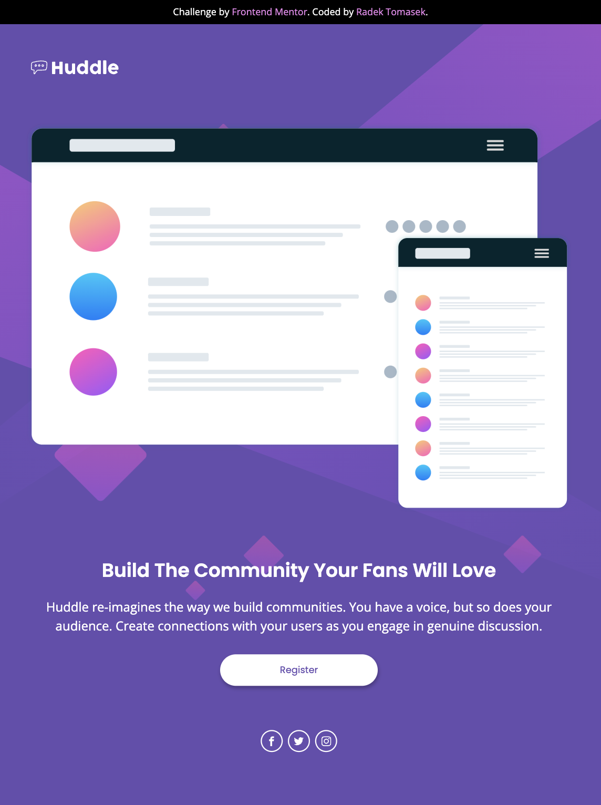
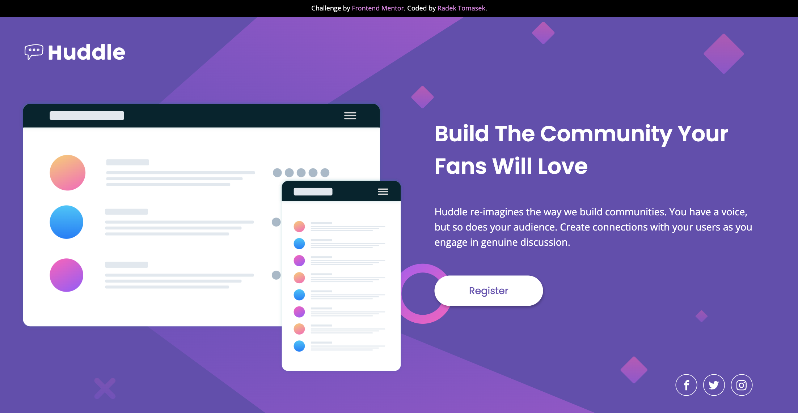

# Huddle landing page with a single introductory section

This repository contains an implementation of one of the Frontend Mentor Challenges - [Huddle landing page with a single introductory section](https://www.frontendmentor.io/challenges/huddle-landing-page-with-a-single-introductory-section-B_2Wvxgi0) using HTML/CSS ([TailwindCSS](https://tailwindcss.com)).

## Overview

I have gained quite significant CSS experience over years whilst building landing pages and projects of various complexities.

Using vanilla CSS is fun, especially when mixed with things like [SASS (SCSS)](https://sass-lang.com/), but I quite like the utility-first approach too.

It was quite a dilema to decide which approach to choose for these challenges on the [https://www.frontendmentor.io](https://www.frontendmentor.io), but in the end, I dediced to go with [TailwindCSS](https://tailwindcss.com) as it seems to be quite elegant and suitable solution for most of the challenges there.

### Screenshots

#### Mobile Version

The page was built with mobile first approach in mind. And tested in various dimensions emulating different mobile devices (small resolutions).

#### Tablet Version

As no tablet breakpoints were specified, I assumed the expected behaviour would be to strech the content until it reaches the desktop breakpoints. Which is the approach you can see in the second screenshot.

#### Desktop Version

Desktop version is the largest one. The usage of Grid helped me to be creative. I made sure the image is stretched enough to be a dominant one even on the large displays.

There are also some constrains for ultra-wide displays. The content is just centered horizontally in such a situation.

It probabably doesn't match the exact design, but I am personally really happy with the final look and feel.

### Links

- Solution URL: [https://github.com/radektomasek/fm-huddle-page-single-section](https://github.com/radektomasek/fm-huddle-page-single-section)
- Live Site URL: [https://radektomasek.github.io/huddle-page-single-section](https://radektomasek.github.io/huddle-page-single-section)

## My process

### Built with

- Semantic HTML5 markup
- CSS Grid
- Mobile-first workflow
- [Parcel](https://parceljs.org) - a simple, zero config builder
- [TailwindCSS](https://tailwindcss.com) - TailwindCSS for styles

### What I learned

In the past, I was using Flexbox for creating most of the page structures. Especially, simple ones like the one in this challenge.

However, I learned about some benefits why [Grid could be a better option for building an overrall layouts](https://css-tricks.com/css-grid-replace-flexbox).

In a nutshell, writing layouts in Grid require less code than when it comes to using Flexbox alternative, therefore there are some performance benefits whilst less maintenance is required too.

The key learning for me was to start considering Grid layout for most of the projects.

Another learning for me was a deeper usage of [SASS (SCSS)](https://sass-lang.com/). I didn't use it for the final site in the end, but I was able to write the first prototype in SCSS and practise the key Grid concepts before switching to [TailwindCSS](https://tailwindcss.com).

And a good thing to learn for me was the opportunity to perform a migration from a SCSS project to the Tailwind one and see the relation between a standard CSS and the Tailwind's utility classes.

Speaking of [TailwindCSS](https://tailwindcss.com), one of the thing I had never liked too much, was cluttering the main template with a lot of Tailwind utility classes.

Therefore, the third learning for me was to play with the Tailwind configuration and base styles to be able to definite the most of the styles outside of HTML document whilst focusing on consistency and extendability.

### Continued development

I was able to build this site relatively comfortably as I had been an experienced developer. However, I really enjoyed the challenge and still learned some solid chunks mentioned in the previous sections.

My goal in the foreseeable future is to keep building these challenges and master the key CSS concepts.

### Useful resources

- [SASS and BEM for Beginners](https://www.youtube.com/watch?v=jfMHA8SqUL4) - Althought I hadn't used SASS and BEM approach in the end, I walked through this video tutorial made by Jessica Chan first and it gave me a solid idea how to convert vanilla CSS into a modern SASS project. Which I used as a base project for the Tailwind implementation.

- [Tailwind CSS From Scratch](https://www.udemy.com/course/tailwind-from-scratch) - This is an Udemy course which I followed more than 1 year ago, but which helped me to understand some good practises when it comes to Tailwind. I utilized that knowledge by building several landing pages and I would like to recommend this one as a good Tailwind tutorial.

## Author

- Frontend Mentor - [@radektomasek](https://www.frontendmentor.io/profile/radektomasek)
- Linkedin - [radektomasek](https://www.linkedin.com/in/radektomasek)
- Twitter - [@radek_tomasek](https://twitter.com/radek_tomasek)
